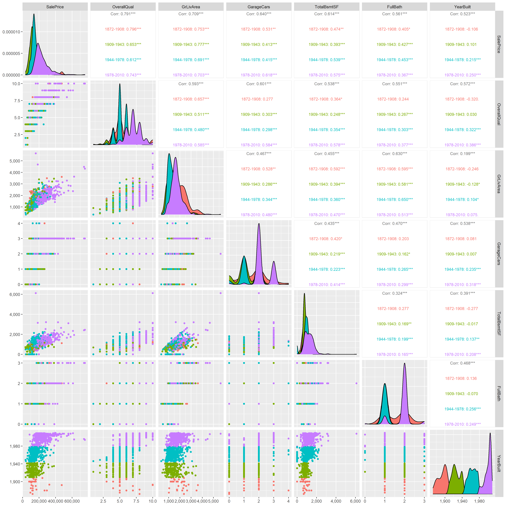

```{r setup, include=FALSE}
knitr::opts_chunk$set(echo = TRUE)
```


# Read the file
```{r results='hide'}
house <- read.csv("data_input/train.csv")
df_house <- read.csv("data_input/train.csv")
str(house)
```
# Data description
`1. SalePrice - the property's sale price in dollars. This is the target variable that you're trying to predict.`
`2. MSSubClass: The building class`
`3. MSZoning: The general zoning classification`
`4. LotFrontage: Linear feet of street connected to property`
`5. LotArea: Lot size in square feet`
`6. Street: Type of road access`
`7. Alley: Type of alley access`
`8. LotShape: General shape of property`
`9. LandContour: Flatness of the property`
`10. Utilities: Type of utilities available`
`11. LotConfig: Lot configuration`
`12. LandSlope: Slope of property`
`13. Neighborhood: Physical locations within Ames city limits`
`14. Condition1: Proximity to main road or railroad`
`15. Condition2: Proximity to main road or railroad (if a second is present)`
`16. BldgType: Type of dwelling`
`17. HouseStyle: Style of dwelling`
`18. OverallQual: Overall material and finish quality`
`19. OverallCond: Overall condition rating`
`20. YearBuilt: Original construction date`
`21. YearRemodAdd: Remodel date`
`22. RoofStyle: Type of roof`
`23. RoofMatl: Roof material`
`24. Exterior1st: Exterior covering on house`
`25. Exterior2nd: Exterior covering on house (if more than one material)`
`26. MasVnrType: Masonry veneer type`
`27. MasVnrArea: Masonry veneer area in square feet`
`28. ExterQual: Exterior material quality`
`29. ExterCond: Present condition of the material on the exterior`
`30. Foundation: Type of foundation`
`31. BsmtQual: Height of the basement`
`32. BsmtCond: General condition of the basement`
`33. BsmtExposure: Walkout or garden level basement walls`
`34. BsmtFinType1: Quality of basement finished area`
`35. BsmtFinSF1: Type 1 finished square feet`
`36. BsmtFinType2: Quality of second finished area (if present)`
`37. BsmtFinSF2: Type 2 finished square feet`
`38. BsmtUnfSF: Unfinished square feet of basement area`
`39. TotalBsmtSF: Total square feet of basement area`
`40. Heating: Type of heating`
`41. HeatingQC: Heating quality and condition`
`42. CentralAir: Central air conditioning`
`43. Electrical: Electrical system`
`44. 1stFlrSF: First Floor square feet`
`45. 2ndFlrSF: Second floor square feet`
`46. LowQualFinSF: Low quality finished square feet (all floors)`
`47. GrLivArea: Above grade (ground) living area square feet`
`48. BsmtFullBath: Basement full bathrooms`
`49. BsmtHalfBath: Basement half bathrooms`
`50. FullBath: Full bathrooms above grade`
`51. HalfBath: Half baths above grade`
`52. Bedroom: Number of bedrooms above basement level`
`53. Kitchen: Number of kitchens`
`54. KitchenQual: Kitchen quality`
`55. TotRmsAbvGrd: Total rooms above grade (does not include bathrooms)`
`56. Functional: Home functionality rating`
`57. Fireplaces: Number of fireplaces`
`58. FireplaceQu: Fireplace quality`
`59. GarageType: Garage location`
`60. GarageYrBlt: Year garage was built`
`61. GarageFinish: Interior finish of the garage`
`62. GarageCars: Size of garage in car capacity`
`63. GarageArea: Size of garage in square feet`
`64. GarageQual: Garage quality`
`65. GarageCond: Garage condition`
`66. PavedDrive: Paved driveway`
`67. WoodDeckSF: Wood deck area in square feet`
`68. OpenPorchSF: Open porch area in square feet`
`69. EnclosedPorch: Enclosed porch area in square feet`
`70. 3SsnPorch: Three season porch area in square feet`
`71. ScreenPorch: Screen porch area in square feet`
`72. PoolArea: Pool area in square feet`
`73. PoolQC: Pool quality`
`74. Fence: Fence quality`
`75. MiscFeature: Miscellaneous feature not covered in other categories`
`76. MiscVal: $Value of miscellaneous feature`
`77. MoSold: Month Sold`
`78. YrSold: Year Sold`
`79. SaleType: Type of sale`
`80. SaleCondition: Condition of sale`

# The library that will be use
```{r,results='hide', warning=FALSE, message=FALSE}
library(ggplot2)
library(hrbrthemes)
library(dplyr)
library(tidyr)
library(viridis)
library(lattice)
library(GGally)
library(fitdistrplus)
library(plotly)
library(scales)
```

# Analysing first
```{r,results='hide', warning=FALSE, message=FALSE}
hist(house$SalePrice, xlab = "House Price", col = "magenta", breaks = 50)+ 
  scale_y_continuous(labels = comma)+
  scale_x_continuous(labels = comma)
```
### Interpretations :
Have appreciable positive skewness
Deviate from the normal distribution
The bigger the price, the smaller the quantity

# relationship beetwwen sales price and house area

## first make a category for the year build
```{r}
house$age_category = with(house, ifelse(
  YearBuilt <= 1908, "1872-1908", ifelse(
    YearBuilt <= 1943, "1909-1943", ifelse(
      YearBuilt <= 1978, "1944-1978", ifelse(
        YearBuilt <= 2010, "1978-2010", ">2010"
  )))))
```


```{r}
ggplot(data = house, 
       mapping = aes(x = GrLivArea,y = SalePrice, color = age_category)) +
  geom_point(size=2, shape = 16)+
  labs(title = "Sale Price & Ground Living Area",
       y = "sale price",
       x = "Ground Living Area",
       color = "Year Build")+ 
  scale_y_continuous(labels = comma)
```

### interpretations: 
sale price & ground living area have a linear relationship the bigger the area, the more expensive the price goes


relationship beetween sales price and basement area
```{r}
ggplot(data = house, 
       mapping = aes(x = TotalBsmtSF,y = SalePrice, color = age_category)) +
  geom_point(size=2, shape = 16)+
  labs(title = "Sale Price & Total basement area",
       y = "sale price",
       x = "Total basement area",
       color = "Year Build")+ 
  scale_y_continuous(labels = comma)
```
### interpretations: 
I see, so total basement also has a strong linear relationship with sale price. just like ground living area, the bigger the basement area, the more expensive it comes


```{r}
unique(house$YearBuilt)
```

# relationship beetween sales price and the quality of the house

```{r}
ggplot(data = house,
       mapping = aes(x = OverallQual, y = SalePrice, group = OverallQual))+ 
  geom_boxplot(mapping = aes(fill = OverallQual))+
    scale_fill_gradient(low = "#f0bf00", high = "#58b258") +
   labs(title = "Sale Price & House Quality",
       y = "House Quality",
       x = "sale price",
       color = NULL) +
  theme(plot.title = element_text(face="bold"))+ 
  scale_y_continuous(labels = comma)
```
### interpretations : 
house quality and sale price are good friends. based on the plot, the better the quality, the more expensive it gets. just like stairs,  they keep going up

```{r}
ggplot(data = house,
       mapping = aes(x = age_category, y =SalePrice)) +
  geom_col(aes(fill = "lightblue"))+
  theme(legend.position="none")+ 
  scale_y_continuous(labels = comma)
```
### interpretations :
so maybe modern House is attract people more? 
note we still dont know if saleprice is in constant price


```{r}
data <- house[ , c("SalePrice", "OverallQual", "GrLivArea","GarageCars","TotalBsmtSF", "FullBath", "YearBuilt","age_category")]
```


```{r, results='hide', warning=FALSE, message=FALSE}
ggcorr(data, label = T)
```

### interpretations :
mostly all the variable is correlated to SalePrice especially OverallQual but FullBath?? Really?

```{r, warning=FALSE, message=FALSE}
plt <- ggpairs(data, columns = 1:7, ggplot2::aes(col = age_category),upper = list(continuous = wrap("cor", size = 3))) + 
  scale_y_continuous(labels = comma)+
  scale_x_continuous(labels = comma)
ggsave("plot.png", plot = plt, width = 15, height = 15, units = "in", dpi = 300)

```
#### no Interpretations for this plot because it's just the same just like before, just want to spoil your eyes :D

```{r}
gg <- ggplot(data = house , aes(x=SalePrice)) +  
  geom_histogram(aes(y = ..density.., fill=age_category),bins = 30, alpha = 0.7)+ 
  geom_density(aes(color=age_category))+  
  geom_rug(aes(color=age_category))+ 
  labs(x = '',  
       y = '',  
       title = 'Distplot with Normal Distribution')+ 
  scale_y_continuous(labels = comma)+ 
  scale_x_continuous(labels = comma)    

ggplotly(gg)%>% 
  layout(plot_bgcolor='#e5ecf6',   
             xaxis = list(   
               title='Sale Price', 
               zerolinecolor = '#ffff',   
               zerolinewidth = 2,   
               gridcolor = 'ffff'),   
             yaxis = list(   
               title='Density', 
               zerolinecolor = '#ffff',   
               zerolinewidth = 2,   
               gridcolor = 'ffff')) 
```
# Missing data
```{r,message=FALSE, warning=FALSE, results='hide'}
df_house[!complete.cases(df_house),]
```

```{r}
sum(is.na(df_house))
```
# Search for normality

```{r, warning=FALSE, message=FALSE}
FIT <- fitdist(df_house$SalePrice, "norm")    
plot(FIT) + 
  scale_y_continuous(labels = comma)+
  scale_x_continuous(labels = comma)  
```

It's look like Sale Price have skewdness, and that's not a big problem because a simple log function will do the magic work

```{r, warning=FALSE, message=FALSE}
df_house$SalePrice <- log(df_house$SalePrice)
FIT2 <- fitdist(df_house$SalePrice, "norm")    
plot(FIT2) 
```

 Yup! Sale Price looking better than before

```{r, message=FALSE, warning=FALSE}
FIT3 <- fitdist(df_house$GrLivArea, "norm")    
plot(FIT3) 
```
some skewdness again happen to GrLivArea

```{r, message=FALSE, warning=FALSE}
df_house$GrLivArea <- log(df_house$GrLivArea) 
FIT4 <- fitdist(df_house$GrLivArea, "norm")    
plot(FIT4)+scale_y_continuous(labels = comma)+
  scale_x_continuous(labels = comma)  
```
Splendid!

```{r, message=FALSE, warning=FALSE}
FIT5 <- fitdist(df_house$TotalBsmtSF, "norm")    
plot(FIT5) +scale_y_continuous(labels = comma)
```
hmmm let's do another log then 

```{r, message=FALSE, warning=FALSE}
FIT6 <- fitdist(df_house$TotalBsmtSF, "norm")    
plot(FIT6) +scale_y_continuous(labels = comma)
```
### That's not looking great so we have ;
Skewdness
A significant number of observations with value zero (houses without basement)
And 0 value that make us cant do log transformation.

To apply a log transformation here, we'll create a variable/filter that can get the effect of having or not having basement (binary variable). Then, we'll do a log transformation to all the non-zero observations. Ignoring the 0 value so we can do Log transformation


```{r, message=FALSE, warning=FALSE}
df_house <- 
  df_house %>%  filter(df_house$TotalBsmtSF > 0)
df_house$TotalBsmtSF <- log(df_house$TotalBsmtSF) 
FIT7 <- fitdist(df_house$TotalBsmtSF, "norm") 
plot(FIT7) 
```
# nice

```{r}
df_house$age_category = with(df_house, ifelse(
  YearBuilt <= 1908, "1872-1908", ifelse(
    YearBuilt <= 1943, "1909-1943", ifelse(
      YearBuilt <= 1978, "1944-1978", ifelse(
        YearBuilt <= 2010, "1978-2010", ">2010"
  )))))
```

#Homoscedasticity

```{r, message=FALSE, warning=FALSE}
ggplot(data = df_house, 
       mapping = aes(x = GrLivArea,y = SalePrice, color = age_category)) +
  geom_point(size=2, shape = 16)+
  labs(title = "Sale Price & Ground Living Area after Norm",
       y = "sale price",
       x = "Ground Living Area",
       color = "Year Build")
```


```{r, message=FALSE, warning=FALSE}
ggplot(data = df_house, 
       mapping = aes(x = TotalBsmtSF,y = SalePrice, color = age_category)) +
  geom_point(size=2, shape = 16)+
  labs(title = "Sale Price & Total Basement Area after Norm",
       y = "sale price",
       x = "Total Basement Area",
       color = "Year Build")
```
### because the current scatter plot doesn't have a conic shape anymore.So we solved the homoscedasticity problem.


